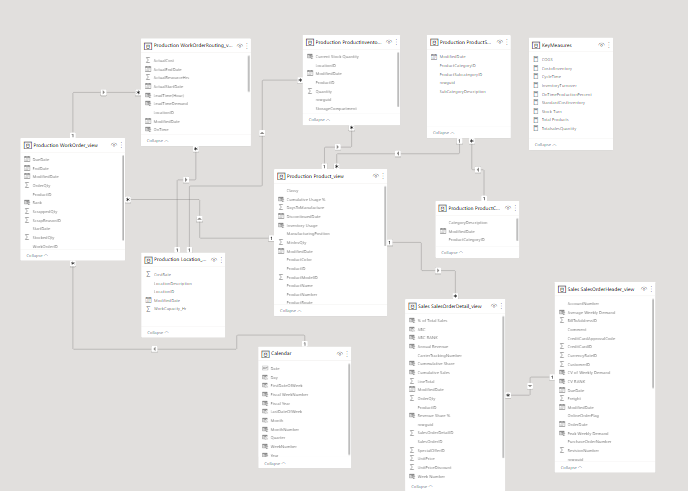

# Inventory-Management-Analysis
This is an Analysis to optimise inventory managemnt for **FitCapacity** company by analyzing sales and inventory data using SQL and PowerBI

---

## Introduction:
This is an Inventory Management analysis done with SQL and PowerBi, I analyzed Inventory data, production data and Sales data from the Adventure Works 2019 database. It is a fitious company named "FitCapacity" and it is intended to solve some problems.

**_Disclaimer_** This is not a real company as we know that advebture works database is compiled by Microsoft for learning purposes.

---
## Problem Statement:

The goal of the analysis is to:
- identify which products have the highest turnover rate and which have the lowest turnover rate.
- identify the average time a product is out of stock and the frequency of stockouts.
- classify products into high-selling, low-selling and average-selling. 
- use the insights gained to make recommendations for how to optimize inventory levels and minimize stockouts which may include adjustments to reorder points, ordering certain products, or discontinuing products that are not selling well.
 ----
 
 ## Skills and Concepts demonstrated:
 
 - SQL (Select, alias, Views)
 - PowerBi concepts like:
   - Data Modelling,
   - Data Analysis Expression (DAX),
   - Calculated columns,
   - Measures,
   - Navigation panes,
   - filters,
   - tooltips, 
   - buttons,
   - bookmarks
   - Data Viaulaization
 ---
  
 ## Data Source:

The data used for this work is gotten from the AdventureWorks 2019 database 2019. I studied the Schema, Objects related to the Schema, data dictionary and found the right tables for the analysis. 

You can find a link to get started with installation and restoration of the database to your local machine.  [here:](https://youtu.be/VpY0Q_kwtIw) 
 ---
 
## Data Transformation:
- Several structured quieries were written to get the right tables and then saved as views in the Database on SQL Management studio.

- Then i imported the views into my PowerBI desktop app 

- Then i selected the right views i had created in SQL

- I tranformed the data in Power Query, checked for Colum quality, consistent or appropriate data types
- I began writing several Dax and creating measures and calculated columns to get the right metrics for the Inventory analysis.
- I also created the calendar table
---

## Data Modelling:
The intelligence in PowerBi makes it such that tables are automatically joined by creating relationships with them. However, as someone that understands the dataset and want to get secific insights and information. I had to create other relationships and measures to enable me. so I did another model. I created 8 dimension tables and 2 fact tables as i hoped for a Star Schema

Created Model               |        Automated Model
:------------------------:  | :----------------------------------:
         | 

---
## Data Analysis

Several expressions and functions were made to

## Data Visualization
The report consists of 4 pages
- The Inventory Page
- The Product Page
- The Sales Page
- insight Page

The report can be interacted with on the PowerBI service [here:](https://app.powerbi.com/view?r=eyJrIjoiNDI0YmQwYjItODQ2MC00YzAyLTlkMjgtMTMxZjExMzA0NzU1IiwidCI6IjM0ODhhMWU5LTQwNmYtNGMzNS04Yjc0LTkyOGUzNDM5Yzc1MCJ9)

